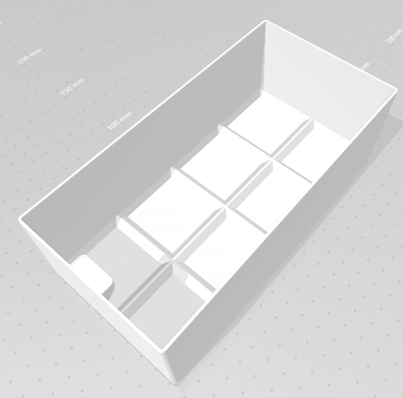

# storage-boxes

A CadQuery fork of the awesome [assortment boxes][0] (video [here][1]) by [Alexandre Chappel][2].

If you find these boxes useful, please consider supporting [Alexandre Chappel][2] by purchasing the original digital download of the box design [here][0].

## Example 2x4 box



## Example 4x4 tray

| No bottom chamfer                                                                                                                                               | Chamfered bottom edges                        |
| --------------------------------------------------------------------------------------------------------------------------------------------------------------- | --------------------------------------------- |
| Filled between outer edges and adjacent upper chamfers; and between pairs of upper chamfers. Might be easiest for gluing to surface due to larger surface area. | This variant reduces filament and print time. |
| [![][no-bottom-chamfer]][no-bottom-chamfer]                                                                                                                     | [![][bottom-chamfer]][bottom-chamfer]         |

[0]: https://www.alch.shop/shop/p/assortment-boxes-v2
[1]: https://youtu.be/VntGnLuwoeY
[2]: https://www.alch.shop/
[no-bottom-chamfer]: docs/static/4x4-tray-no-chamfer-screenshot.png
[bottom-chamfer]: docs/static/4x4-tray-chamfered-screenshot.png


# Install

```
git clone 
cd ...
conda env create -n cadquery-boxes --file environment.yml 
conda activate cadquery-boxes
```

# Usage

See below for CLI tool usage example. Note that you can customize the unit
size and the box height using the respective CLI flags. All box sizes from
1x1 to 4x4 have been prebuilt along with the corresponding tray frames and
are available as [GitHub release v0.1][1].

```
> cd src
> python -m storage_boxes.models --help
Usage: models.py [OPTIONS] OUTPUT_DIR

Arguments:
  OUTPUT_DIR  [required]

Options:
  --unit-extent FLOAT
  --height FLOAT
  --install-completion  Install completion for the current shell.
  --show-completion     Show completion for the current shell, to copy it or
                        customize the installation.

  --help                Show this message and exit.
> # Write all box sizes and base frames from 1x1 to 4x4 to specified output directory.
> python -m storage_boxes.models <output_dir>
```

# Development

## Install the `jupyter-cadquery` Jupyter Lab extension

```
# See https://github.com/bernhard-42/jupyter-cadquery#installation
wget -O jupyter-cadquery-environment.yml https://raw.githubusercontent.com/bernhard-42/jupyter-cadquery/v2.0.0-beta3/environment.yml
wget https://raw.githubusercontent.com/bernhard-42/jupyter-cadquery/v2.0.0-beta3/labextensions.txt
conda env update -n cadquery-boxes --file jupyter-cadquery-environment.yml 
jupyter-labextension install --no-build $(cat labextensions.txt)
jupyter lab build --dev-build=False --minimize=False
jupyter lab
```

## Notes

The interesting bits of code:

- [`models.main()`][models.main]: generate all parts from 1x1 to 4x4
- [`models.make_storage_tray()`][models.make_storage_tray]: create a storage tray, customized by [`BoxParameters`][box-parameters] as used to create 
- [`models.make_storage_box()`][models.make_storage_box]: create a box, customized by the same [`BoxParameters`][box-parameters] as [`models.make_storage_tray()`][models.make_storage_tray]


[1]: https://github.com/cfobel/storage-boxes/releases/tag/v0.1
[models.main]: https://github.com/cfobel/storage-boxes/blob/main/src/storage_boxes/models.py#L136
[models.make_storage_box]: https://github.com/cfobel/storage-boxes/blob/main/src/storage_boxes/models.py#L52
[models.make_storage_tray]: https://github.com/cfobel/storage-boxes/blob/main/src/storage_boxes/models.py#L97
[box-parameters]: https://github.com/cfobel/storage-boxes/blob/main/src/storage_boxes/types.py#L10

# License

Licensed under the [MIT license](LICENSE.md).